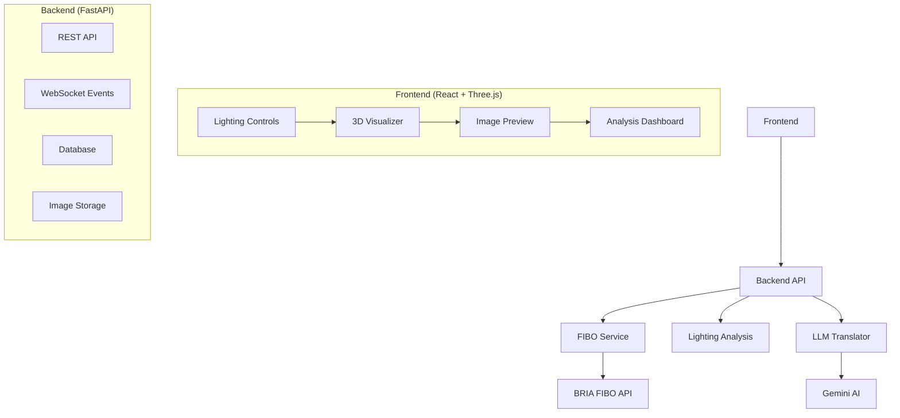
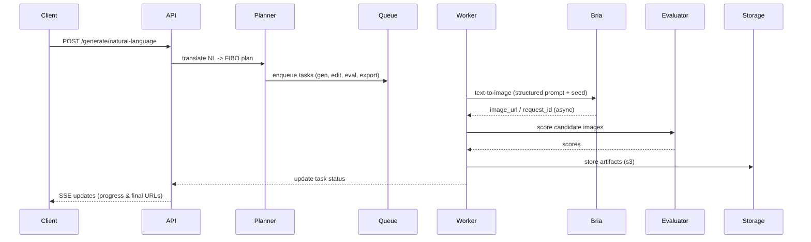
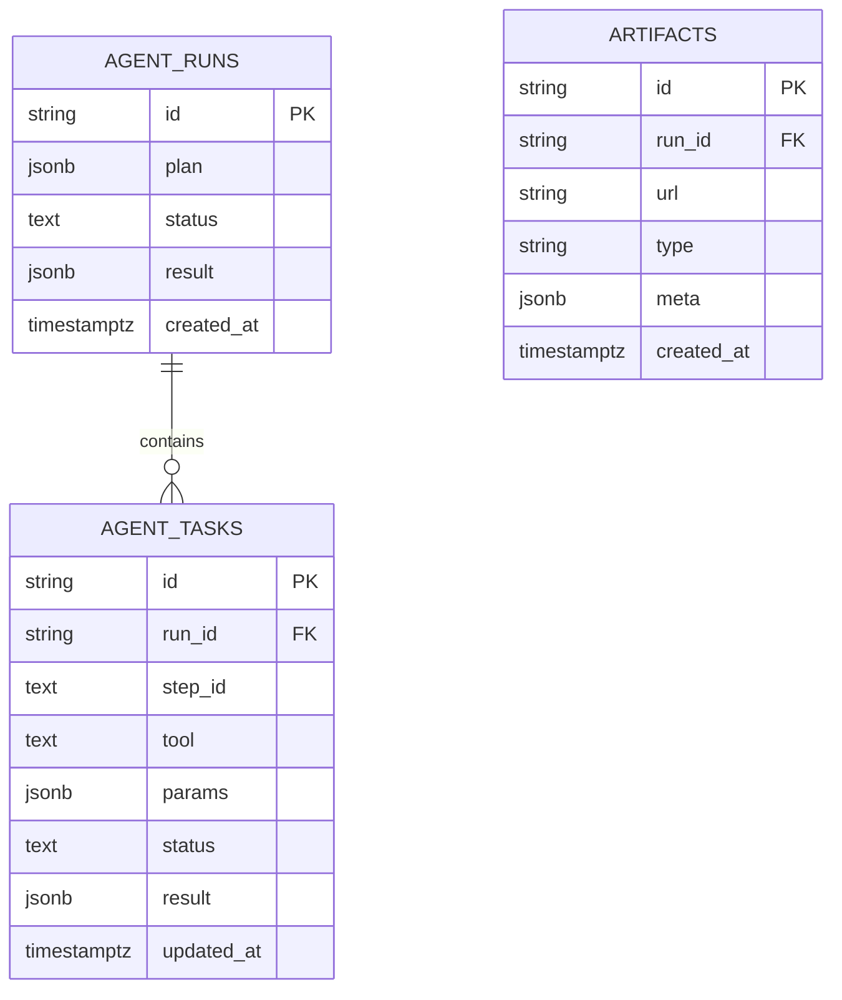
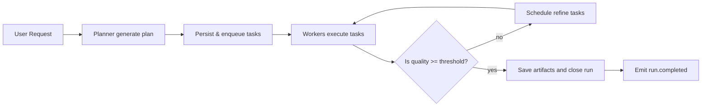

# ProLight AI - Professional Lighting Simulator

<div align="center">


**Precision Lighting, Powered by FIBO**

[Demo](#demo) • [Features](#features) • [Installation](#installation) • [API](#api) • [Architecture](#architecture) • [Contributing](#contributing)

</div>

## 🎯 Overview

ProLight AI is a revolutionary studio lighting simulator that bridges the gap between photographic expertise and AI image generation. By leveraging **BRIA FIBO's JSON-native architecture**, we replace unpredictable text prompts with precise, professional lighting parameters—enabling perfect studio setups in seconds without expensive equipment.

> **Innovation**: Unlike traditional AI image generators that rely on ambiguous text prompts, ProLight AI provides deterministic control through structured JSON parameters, giving photographers and creators reproducible, professional-grade results.

## 🚀 Key Features

### 🎨 **Professional Lighting Control**
- **3-Point Lighting System**: Key, fill, rim, and ambient light controls
- **Real-time 3D Visualization**: Interactive Three.js preview of lighting setups
- **Precise Parameter Control**: Intensity, color temperature, softness, distance, and direction
- **Professional Presets**: Butterfly, Rembrandt, dramatic fashion, and soft portrait lighting

### 🤖 **FIBO JSON-Native Integration**
- **Structured JSON Generation**: Convert natural language to precise FIBO JSON schemas
- **Deterministic Results**: Same parameters = same output every time
- **Parameter Disentanglement**: Modify individual lighting elements without affecting others
- **Three Operation Modes**: Generate, Refine, and Inspire workflows

### 📊 **Advanced Analysis**
- **Lighting Ratio Calculator**: Real-time key-to-fill ratio analysis
- **Professional Rating System**: AI-powered quality assessment (1-10 scale)
- **Color Harmony Analysis**: Temperature consistency and mood assessment
- **Technical Recommendations**: Expert suggestions for improvement

### 🎮 **Premium User Experience**
- **Glass Morphism UI**: Modern, professional interface with smooth animations
- **Real-time Previews**: Instant 3D visualization of lighting changes
- **Drag & Drop Controls**: Intuitive parameter adjustment
- **Responsive Design**: Works seamlessly on desktop, tablet, and mobile

## 🏗️ System Architecture



### Technology Stack

| Layer | Technology | Purpose |
|-------|------------|---------|
| **Frontend** | React 18 + TypeScript | Modern UI framework with type safety |
| **3D Graphics** | Three.js + React Three Fiber | Real-time lighting visualization |
| **UI/UX** | Framer Motion + Tailwind CSS | Smooth animations and professional design |
| **Backend** | FastAPI + Python 3.11 | High-performance API server |
| **AI/ML** | BRIA FIBO + Gemini AI | Image generation and natural language processing |
| **Database** | SQLite + SQLAlchemy | Data persistence and user sessions |
| **Deployment** | Docker + Vercel | Containerized deployment |

## 🛠️ Installation

### Prerequisites

- **Node.js** 18+ and **npm** 9+
- **Python** 3.11+
- **Docker** and **Docker Compose** (optional)

### Quick Start

```bash
# Clone the repository
git clone https://github.com/your-username/prolight-ai.git
cd prolight-ai

# Backend setup
cd backend
python -m venv venv
source venv/bin/activate  # Windows: venv\Scripts\activate
pip install -r requirements.txt

# Frontend setup
cd ../frontend
npm install
npm run dev

# Environment configuration
cp backend/.env.example backend/.env
# Add your API keys to backend/.env
```

### Environment Variables

```env
# Backend (.env)
BRIA_API_KEY=your_bria_api_key_here
GEMINI_API_KEY=your_gemini_api_key_here
DATABASE_URL=sqlite:///./pro_lighting.db
SECRET_KEY=your_secret_key_here

# Frontend (.env.local)
VITE_API_URL=http://localhost:8000
VITE_APP_NAME=ProLight AI
```

### Docker Deployment

```yaml
# docker-compose.yml
version: '3.8'
services:
  backend:
    build: ./backend
    ports:
      - "8000:8000"
    environment:
      - BRIA_API_KEY=${BRIA_API_KEY}
      - GEMINI_API_KEY=${GEMINI_API_KEY}
    volumes:
      - ./data:/app/data

  frontend:
    build: ./frontend
    ports:
      - "3000:3000"
    depends_on:
      - backend
```

```bash
docker-compose up -d
```

## 📚 API Documentation

### Core Endpoints

#### Generate Image from Lighting Setup
```http
POST /api/generate/lighting-setup
Content-Type: application/json

{
  "subject_description": "professional model in studio",
  "environment": "minimalist photography studio",
  "lighting_setup": {
    "key": {
      "direction": "45 degrees camera-right",
      "intensity": 0.8,
      "color_temperature": 5600,
      "softness": 0.5,
      "distance": 1.5,
      "enabled": true
    },
    "fill": {
      "direction": "30 degrees camera-left",
      "intensity": 0.4,
      "color_temperature": 5600,
      "softness": 0.7,
      "distance": 2.0,
      "enabled": true
    }
  },
  "camera_settings": {
    "shot_type": "medium shot",
    "camera_angle": "eye-level",
    "fov": 85,
    "lens_type": "portrait",
    "aperture": "f/2.8"
  }
}
```

#### Natural Language Generation
```http
POST /api/generate/natural-language
Content-Type: application/json

{
  "scene_description": "a professional model in a studio",
  "lighting_description": "soft butterfly lighting with warm tones",
  "subject": "fashion model",
  "style_intent": "professional portrait"
}
```

#### Lighting Analysis
```http
POST /api/analyze/lighting
Content-Type: application/json

{
  "lighting_setup": { /* lighting configuration */ }
}
```

### FIBO JSON Schema

```json
{
  "subject": {
    "main_entity": "professional photographer",
    "attributes": ["professional", "focused"],
    "action": "adjusting camera settings"
  },
  "environment": {
    "setting": "professional studio",
    "time_of_day": "controlled lighting"
  },
  "camera": {
    "shot_type": "medium shot",
    "camera_angle": "eye-level",
    "fov": 85,
    "lens_type": "portrait"
  },
  "lighting": {
    "main_light": {
      "direction": "45 degrees camera-right",
      "intensity": 0.8,
      "color_temperature": 5600,
      "softness": 0.5
    },
    "fill_light": {
      "direction": "30 degrees camera-left",
      "intensity": 0.4,
      "color_temperature": 5600,
      "softness": 0.7
    }
  },
  "style_medium": "photograph",
  "artistic_style": "professional studio photography"
}
```

## 🎮 Usage Examples

### Basic Lighting Setup
```javascript
// Create a classical Rembrandt lighting setup
const lightingSetup = {
  key: {
    direction: "45 degrees left and above",
    intensity: 0.9,
    colorTemperature: 5600,
    softness: 0.6,
    distance: 1.5,
    enabled: true
  },
  fill: {
    direction: "30 degrees right", 
    intensity: 0.3,
    colorTemperature: 4500,
    softness: 0.7,
    distance: 2.0,
    enabled: true
  }
};

// Generate image with this setup
const result = await generateFromLightingSetup({
  subject_description: "professional portrait subject",
  environment: "dark studio with gray backdrop",
  lighting_setup: lightingSetup,
  camera_settings: {
    shot_type: "medium close-up",
    camera_angle: "eye-level",
    fov: 85,
    lens_type: "portrait"
  }
});
```

### Natural Language Workflow
```javascript
// Use natural language to create complex lighting
const result = await generateFromNaturalLanguage({
  scene_description: "a fashion model in a luxury studio",
  lighting_description: "dramatic high-contrast lighting with strong rim light",
  subject: "fashion model in evening dress",
  style_intent: "editorial fashion"
});
```

## 🔧 Development

### Project Structure
```
prolight-ai/
├── backend/
│   ├── app/
│   │   ├── api/           # FastAPI routes
│   │   ├── core/          # Configuration and clients
│   │   ├── models/        # Pydantic schemas
│   │   ├── services/      # Business logic
│   │   └── utils/         # Helper functions
│   ├── tests/             # Backend tests
│   └── requirements.txt   # Python dependencies
├── frontend/
│   ├── src/
│   │   ├── components/    # React components
│   │   ├── contexts/      # State management
│   │   ├── hooks/         # Custom React hooks
│   │   ├── pages/         # Next.js pages
│   │   └── styles/        # Tailwind CSS
│   ├── public/            # Static assets
│   └── package.json       # Node dependencies
└── docs/                  # Documentation
```

### Running Tests
```bash
# Backend tests
cd backend
pytest tests/ -v

# Frontend tests  
cd frontend
npm test

# End-to-end tests
npm run test:e2e
```

### Code Quality
```bash
# Backend code quality
black app/ tests/
isort app/ tests/
flake8 app/ tests/

# Frontend code quality
npm run lint
npm run format
```

## 🎯 FIBO Integration Details

### Why FIBO?
- **JSON-Native Architecture**: Structured prompts instead of ambiguous text
- **Deterministic Control**: Reproducible results with same parameters
- **Professional Parameters**: Camera, lighting, and composition controls
- **Commercial Licensing**: Fully licensed training data

### Implementation Highlights

```python
# FIBO Client Implementation
class FIBOClient:
    async def generate_image(self, fibo_json: Dict[str, Any]) -> Dict[str, Any]:
        """Generate image using FIBO's structured JSON"""
        payload = {
            "prompt": json.dumps(fibo_json),
            "steps": 50,
            "guidance_scale": 7.5,
            "output_format": "url",
            "enhance_hdr": fibo_json.get("enhancements", {}).get("hdr", False)
        }
        
        response = await self.client.post(
            f"{self.base_url}/generate",
            json=payload
        )
        return response.json()
```

## 📊 Performance Metrics

| Metric | Value | Target |
|--------|-------|--------|
| Image Generation Time | 2-4 seconds | < 5 seconds |
| 3D Visualization FPS | 60 FPS | > 30 FPS |
| API Response Time | < 100ms | < 200ms |
| Concurrent Users | 100+ | 50+ |


# ProLight AI — Professional Lighting Simulator (Technical README)

<div align="center">


</div>

**Precision Lighting, Powered by FIBO** — technical reference, developer guide, and architecture spec for the ProLight AI system.
This README is intended for engineers building or extending the ProLight stack (front-end, backend, infra, agentic orchestration, evaluators).

---

## Contents

* [Overview](#overview)
* [Design goals & core concepts](#design-goals--core-concepts)
* [High-level architecture (detailed diagrams)](#high-level-architecture-detailed-diagrams)
* [Data models & FIBO schemas](#data-models--fibo-schemas)
* [API specification (detailed)](#api-specification-detailed)
* [Agentic workflow: planner → orchestrator → workers](#agentic-workflow-planner--orchestrator--workers)
* [Evaluator design (CLIP / perceptual metric plugin)](#evaluator-design-clip--perceptual-metric-plugin)
* [Database migrations & caching strategy](#database-migrations--caching-strategy)
* [Security, secrets & governance](#security-secrets--governance)
* [Deployment & DevOps (Docker, K8s, CI)](#deployment--devops-docker-k8s-ci)
* [Testing, observability & cost controls](#testing-observability--cost-controls)
* [Appendices: code snippets, SQL, mermaid diagrams](#appendices-code-snippets-sql-mermaid-diagrams)

---

## Overview

ProLight AI converts photographic expertise into reproducible, auditable image generation workflows by:

* representing lighting/camera/shot parameters as **FIBO JSON** (structured prompts),
* using Bria (FIBO-enabled) generation and editing endpoints for determinism,
* orchestrating multi-step, agentic workflows that generate → evaluate → refine → export,
* providing a realtime UI (React + R3F) with an SSE/WebSocket progress stream.

**Primary objectives**

* *Determinism*: same structured prompt + seed → same output.
* *Auditability*: store all prompts, seeds, tool calls and evaluator scores.
* *Modularity*: tool-agents (text2image, edit, onboard, evaluate, storage) are thin wrappers and interchangeable.
* *Safety & governance*: server-side secrets, content moderation flags, restricted LLM usage.

---

## Design goals & core concepts

* **FIBO Structured Prompt** — canonical JSON schema that fully describes the photographic scene (objects, camera, lights, metadata, locked_fields).
* **Tool Agent** — single-responsibility wrapper that communicates with an external API (Bria, S3/MinIO, evaluator).
* **Planner** — converts high-level goals (user request) into an ordered plan of tasks (finite-state planner or LLM-based).
* **Orchestrator** — persists the plan, enqueues tasks, exposes run status, issues SSE updates.
* **Worker** — executes tasks, updates DB, calls evaluators, uploads artifacts.
* **Evaluator** — automatic scoring (CLIP, SSIM, LPIPS, human-in-the-loop), used to select and iterate.

---

## High-level architecture (detailed diagrams)

### Architecture overview (mermaid)

```mermaid
flowchart TD
  U[User UI (React + R3F)] -->|POST /generate| API[Backend REST (FastAPI/Express)]
  API --> Planner[Planner (LLM or finite-state)]
  Planner --> DB[(Postgres: runs / tasks / artifacts)]
  API -->|enqueue| Queue[(Redis / BullMQ)]
  Queue --> Worker[Worker Pool (Node/Python)]
  Worker -->|call| Bria[Bria FIBO APIs]
  Worker -->|upload| Storage[(S3 / MinIO)]
  Worker --> Evaluator[Perceptual Evaluator (CLIP/LPIPS)]
  Worker --> API
  API -->|SSE/WS| U
```

### Sequence diagram — generation run



### Data model ERD (simplified)



---

## Data models & FIBO schemas

### Canonical FIBO lighting prompt (recommended schema)

```json
{
  "schema_version": "fibo_v1",
  "metadata": {
    "project": "campaign-123",
    "seed": 12345,
    "creator": "user_abc",
    "locked_fields": ["camera", "composition"]
  },
  "scene": {
    "subject": {"description": "silver table lamp", "position": {"x":0,"y":0,"z":0}},
    "background": {"type":"seamless","color":"#ffffff"},
    "camera": {"fov":85,"aperture":"f/4","distance":1.2,"angle":"eye-level"},
    "lighting": {
      "key": {"type":"directional","intensity":1.1,"kelvin":5600,"direction":[0.5,-0.2,1.0],"softness":0.2},
      "fill": {"type":"softbox","intensity":0.5,"kelvin":5600,"direction":[-0.3,0.2,0.5],"softness":0.7},
      "rim": {"type":"hairlight","intensity":0.4,"direction":[0,0.6,-0.5]}
    }
  },
  "output": {"aspect_ratio":"4:5","resolution":[2048,2560],"format":"png"}
}
```

**Notes**

* `seed` ensures deterministic generation.
* `locked_fields` prevents refinement steps from altering camera/composition.
* `lighting.direction` is a normalized vector or human-readable angle; pick one convention and document it.

---

## API specification (detailed)

All server-to-Bria calls must be server-side. Bria requires `api_token` header on requests.

### 1. `POST /api/generate/lighting-setup`

* **Input**: FIBO JSON or a simplified subset (see examples above).
* **Behavior**:

  1. Validate schema (Pydantic / JSON Schema).
  2. Persist run + plan to DB with status `created`.
  3. Enqueue tasks (text-to-image → evaluate → optional edits → export).
  4. Return `run_id`.
* **Response**:

```json
{ "run_id": "uuid", "status": "created", "queued_steps": 4 }
```

### 2. `POST /api/generate/natural-language`

* **Input**:

```json
{ "scene_description": "...", "lighting_description":"...", "style_intent":"editorial", "num_results":3 }
```

* **Behavior**:

  * Either: call LLM translator (Gemini) to produce FIBO JSON, OR call finite deterministic planner to map NL to parameter variants.
  * Then follow same pipeline as `lighting-setup`.
* **Security**: enforce rate limits & validate NL input to avoid prompt injection.

### 3. `GET /api/status/{run_id}`

* Returns run state (created / in_progress / completed / failed) and summary:

```json
{
  "run_id":"uuid",
  "status":"in_progress",
  "steps":[ { "id":"gen_prompt_1", "status":"completed", "result": {...} } ],
  "artifacts":[ {"url":"s3://...","type":"png","seed":12345} ]
}
```

### 4. `GET /api/stream/{run_id}` — Server-Sent Events (SSE)

* Streams JSON messages:

  * `run.created` → `task.started` → `task.completed` → `artifact.ready` → `run.completed`
* Authentication: SSE must use short-lived token issued by backend (JWT with `run_id` claim).

---

## Agentic workflow: planner → orchestrator → workers

### Planner

* Two modes:

  * **Finite deterministic planner** (recommended for reproducibility): uses domain rules and templates to produce deterministic variants (seeds, small parameter deltas).
  * **LLM-based planner**: used for creative suggestions; must be post-validated and sanitized into FIBO JSON schema.

**Finite planner pseudo-code**

```python
def finite_plan(n, base_fibo):
    plans = []
    base_seed = base_fibo.metadata.seed or time_seed()
    for i in range(n):
        cloned = deepcopy(base_fibo)
        cloned.metadata.seed = base_seed + i
        # small deltas for fill/key intensity or kelvin
        cloned.scene.lighting.fill.intensity *= (1 + (i-1)*0.05)
        plans.append(cloned)
    return plans
```

### Orchestrator

* Persists `agent_run` with `plan` (JSON), enqueues tasks into Redis/BullMQ, returns `run_id`.
* Emits `run.created` via EventBus.

### Worker

* Consumes tasks; for each task:

  * Lock/claim task (DB optimistic lock).
  * Execute tool-agent; persist result.
  * Emit SSE update using EventBus.
  * If task completes, schedule dependent tasks.

**Idempotency**

* Check cache table keyed by `prompt_hash:seed:model` before calling Bria.
* If exists, reuse artifact; mark task `cached`.

---

## Evaluator design (CLIP / perceptual metric plugin)

Evaluator responsibilities:

* score candidate images vs. a reference prompt or image,
* produce ranking, pass/fail on thresholds,
* provide bounding metrics for UI (confidence, perceptual distance).

### Architecture

* **Evaluator service** (container) with endpoints:

  * `POST /eval/clip` — returns `[{url, score}]`
  * `POST /eval/lpips` — returns LPIPS distances
  * `POST /eval/ensemble` — combines CLIP + LPIPS + heuristic lighting checks

### CLIP-based scorer (high level)

* Encode image into CLIP embeddings.
* Encode textual structured prompt by converting important keys into short textual description or use a pretrained image-prompt adapter to produce text embedding.
* Cosine similarity between embeddings → `score`.

### Perceptual (LPIPS) comparator

* Compute LPIPS distances between candidate and reference image (if available) or between baseline and candidate to measure change magnitude.
* Normalize distances to [0..1].

### Example eval pipeline

1. Run CLIP similarity vs. derived textual prompt.
2. Run LPIPS vs. baseline (if present).
3. Run heuristics: check histogram extremes, saturation, color-temp drift.
4. Aggregate into `final_score = 0.6*clip + 0.4*(1 - lpips_norm)`.

**Outputs**

```json
{ "scores":[ {"url":"...","clip":0.92,"lpips":0.12,"final":0.88} ], "top": { "url":"...","score":0.88 } }
```

---

## Database migrations & caching strategy

### Tables (recommended)

* `agent_runs (id, plan jsonb, status text, meta jsonb, created_at)`
* `agent_tasks (id, run_id, step_id, tool, params jsonb, status, attempts int, result jsonb)`
* `artifacts (id, run_id, url, type, meta jsonb)`
* `prompt_cache (prompt_hash, seed, model, artifact_id, created_at)`

### Example migration (SQL)

```sql
CREATE TABLE prompt_cache (
  prompt_hash TEXT NOT NULL,
  seed INTEGER NOT NULL,
  model TEXT NOT NULL,
  artifact_id TEXT REFERENCES artifacts(id),
  created_at TIMESTAMP DEFAULT now(),
  PRIMARY KEY (prompt_hash, seed, model)
);
```

### Caching policy

* After generation completes, insert into `prompt_cache`.
* On new generation request, compute `prompt_hash` (SHA-256 of canonical JSON) + `seed` + `model`. If cache hit → reuse artifact (zero-cost to Bria).

---

## Security, secrets & governance

* **Never expose `BRIA_API_TOKEN` to the browser.** Always call Bria from server-side code.
* Store secrets in **Vault / AWS Secrets Manager / Kubernetes Secrets** — not in `.env` for production.
* Use **short-lived SSE tokens**:

  * Issue JWT containing `run_id` claim and expiration (e.g. 60s).
  * SSE endpoint must validate token and only send events for that `run_id`.
* **Content moderation**: set `content_moderation=true` when calling Bria endpoints; if an input image fails moderation, fail-fast and return a detailed error to the run (do not continue).
* **Audit logs**: log each external call (request/response headers stripped of secrets) to an append-only audit store.

---

## Deployment & DevOps (Docker, K8s, CI)

### Local dev (docker-compose)

* Services: backend, postgres, redis, minio, evaluator (optional).
* Use `env_file` for local env vars but **do not** commit `.env`.

### Production

* Containerize backend; deploy behind API Gateway / Ingress with TLS.
* Use managed Postgres (RDS) or Cloud SQL.
* Use autoscaling worker pools (Kubernetes HPA) and Redis cluster for queueing.
* Use object storage (S3) with lifecycle policies (move to Glacier after TTL).

### CI/CD

* Run `gitleaks` and `pre-commit` checks in CI.
* Run unit/integration tests, generate artifacts, deploy only on merge to protected branches.
* Keep deploy keys and tokens in GitHub Actions Secrets or Vault.

---

## Testing, observability & cost controls

### Tests

* Unit test planner logic and schema validators.
* Integration tests: run the worker locally with a mocked Bria client (nock/httpx-mock).
* End-to-end: start stack with docker-compose, run example flows, assert artifacts exist.

### Observability

* Metrics: generation latency, tasks/sec, Bria API errors, evaluator time.
* Tracing: propagate `trace_id` across planner → tasks → workers → Bria.
* Alerts: error rate > threshold, cost burn rate spikes.

### Cost controls

* Track cost estimate per tool call in `agent_runs.meta.budget_usd`.
* Implement stop conditions:

  * `max_iterations`
  * `budget_exhausted`
  * `top_score > threshold`

---

## Appendices: practical snippets & diagrams

### Prompt hashing (canonicalization)

```python
import hashlib, json
def canonical_hash(obj):
    s = json.dumps(obj, sort_keys=True, separators=(',',':'))
    return hashlib.sha256(s.encode('utf-8')).hexdigest()
```

### SSE short-lived token (example)

```python
# issue token (server)
payload = {"run_id": run_id, "exp": time.time()+60}
token = jwt.encode(payload, SECRET_KEY, algorithm="HS256")

# client connects: /api/stream/{run_id}?token=<token>
# server validates token and run_id match
```

### Sample worker retry/backoff (pseudocode)

```python
attempt = 0
while attempt < MAX:
    try:
        call_bria(...)
        break
    except HTTP429 as e:
        sleep(min(60, 2 ** attempt))
        attempt += 1
```

### Example mermaid — agent decision loop




## 🤝 Contributing

We welcome contributions! Please see our [Contributing Guidelines](CONTRIBUTING.md) for details.

### Development Workflow
1. Fork the repository
2. Create a feature branch (`git checkout -b feature/amazing-feature`)
3. Commit your changes (`git commit -m 'Add amazing feature'`)
4. Push to the branch (`git push origin feature/amazing-feature`)
5. Open a Pull Request

### Code Standards
- Follow PEP 8 (Python) and Airbnb Style Guide (JavaScript)
- Write comprehensive tests for new features
- Update documentation for API changes
- Use conventional commit messages

## 📄 License

This project is licensed under the MIT License - see the [LICENSE](LICENSE) file for details.

## 🙏 Acknowledgments

- **BRIA AI** for the FIBO model and API access
- **Google Gemini** for natural language processing
- **Three.js** community for 3D graphics components
- **FastAPI** and **React** communities for excellent frameworks

## 🏆 Hackathon Submission

This project was created for the **FIBO Hackathon 2024** and demonstrates:

- ✅ **Innovative Use of FIBO**: JSON-native parameter control for deterministic results
- ✅ **Professional Application**: Solves real photography workflow problems
- ✅ **Technical Excellence**: Full-stack implementation with advanced features
- ✅ **User Experience**: Intuitive interface with real-time feedback

---

<div align="center">

**ProLight AI** - *Precision Lighting, Powered by FIBO*

[Report Bug](https://github.com/your-username/prolight-ai/issues) • [Request Feature](https://github.com/your-username/prolight-ai/issues)

</div>

