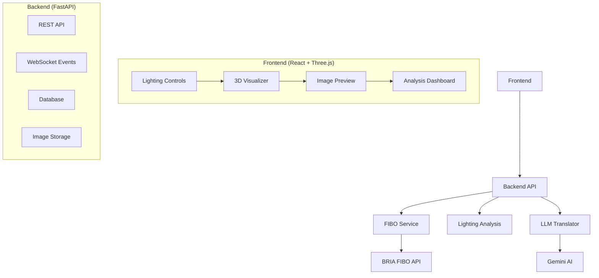
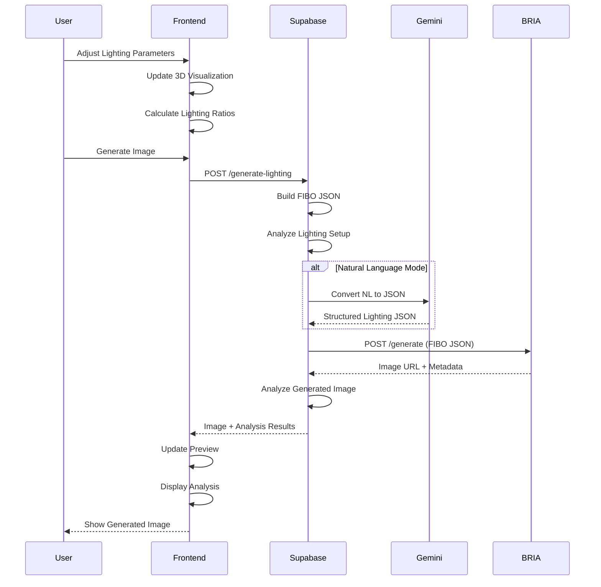
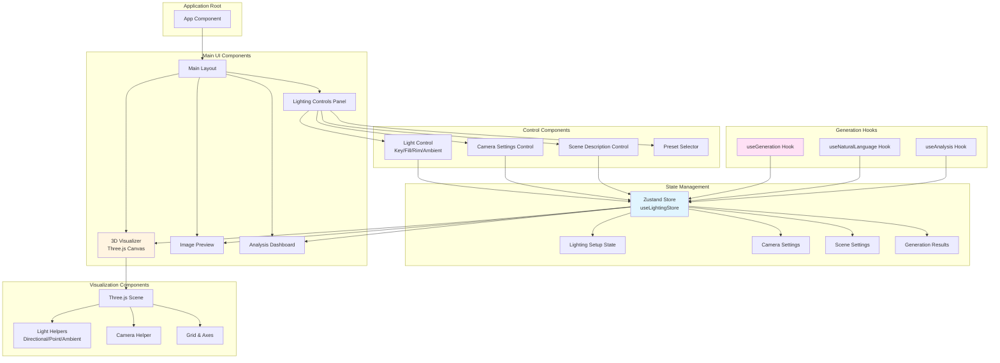
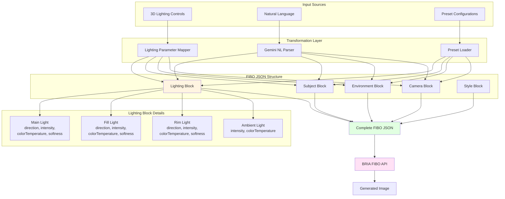
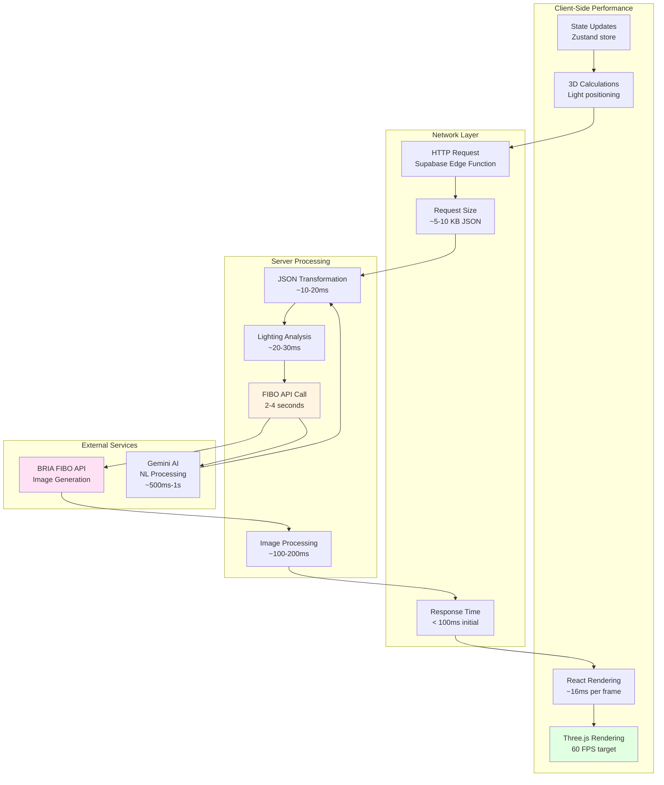
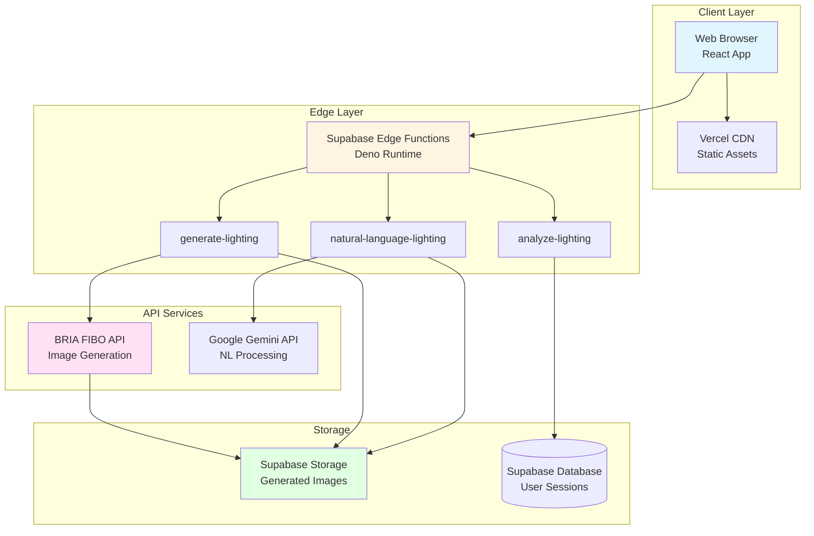

# ProLight AI - Professional Lighting Simulator

<div align="center">


**Precision Lighting, Powered by FIBO**

[Demo](#demo) • [Features](#features) • [Installation](#installation) • [API](#api) • [Architecture](#architecture) • [Contributing](#contributing)

</div>

## 🎯 Overview

ProLight AI is a revolutionary studio lighting simulator that bridges the gap between photographic expertise and AI image generation. By leveraging **BRIA FIBO's JSON-native architecture**, we replace unpredictable text prompts with precise, professional lighting parameters—enabling perfect studio setups in seconds without expensive equipment.

> **Innovation**: Unlike traditional AI image generators that rely on ambiguous text prompts, ProLight AI provides deterministic control through structured JSON parameters, giving photographers and creators reproducible, professional-grade results.

## 🚀 Key Features

### 🎨 **Professional Lighting Control**
- **3-Point Lighting System**: Key, fill, rim, and ambient light controls
- **Real-time 3D Visualization**: Interactive Three.js preview of lighting setups
- **Precise Parameter Control**: Intensity, color temperature, softness, distance, and direction
- **Professional Presets**: Butterfly, Rembrandt, dramatic fashion, and soft portrait lighting

### 🤖 **FIBO JSON-Native Integration**
- **Structured JSON Generation**: Convert natural language to precise FIBO JSON schemas
- **Deterministic Results**: Same parameters = same output every time
- **Parameter Disentanglement**: Modify individual lighting elements without affecting others
- **Three Operation Modes**: Generate, Refine, and Inspire workflows

### 📊 **Advanced Analysis**
- **Lighting Ratio Calculator**: Real-time key-to-fill ratio analysis
- **Professional Rating System**: AI-powered quality assessment (1-10 scale)
- **Color Harmony Analysis**: Temperature consistency and mood assessment
- **Technical Recommendations**: Expert suggestions for improvement

### 🎮 **Premium User Experience**
- **Glass Morphism UI**: Modern, professional interface with smooth animations
- **Real-time Previews**: Instant 3D visualization of lighting changes
- **Drag & Drop Controls**: Intuitive parameter adjustment
- **Responsive Design**: Works seamlessly on desktop, tablet, and mobile

## 🏗️ System Architecture



### Data Flow Architecture

```mermaid
flowchart LR
    Start([User Input]) --> InputType{Input Type?}
    
    InputType -->|3D Lighting Setup| LightingUI[Lighting Controls UI]
    InputType -->|Natural Language| NLInput[Natural Language Input]
    
    LightingUI --> LightingStore[Zustand State Store]
    NLInput --> Gemini[Gemini AI<br/>NL to JSON]
    
    Gemini --> LightingStore
    LightingStore --> FIBOMapper[FIBO JSON Mapper]
    
    FIBOMapper --> Analysis[Lighting Analysis Engine]
    Analysis --> FIBOJSON[Structured FIBO JSON]
    
    FIBOJSON --> SupabaseFn[Supabase Edge Function]
    SupabaseFn --> BRIAAPI[BRIA FIBO API]
    
    BRIAAPI --> ImageGen[Image Generation]
    ImageGen --> Result[Generated Image]
    
    Result --> Preview[3D Preview Update]
    Result --> AnalysisDash[Analysis Dashboard]
    
    Preview --> End([User Feedback])
    AnalysisDash --> End
    
    style LightingUI fill:#e1f5ff
    style NLInput fill:#e1f5ff
    style FIBOJSON fill:#fff4e1
    style BRIAAPI fill:#ffe1f5
    style Result fill:#e1ffe1
```



### Request Sequence Diagram



### Technology Stack

| Layer | Technology | Purpose |
|-------|------------|---------|
| **Frontend** | React 18 + TypeScript | Modern UI framework with type safety |
| **3D Graphics** | Three.js + React Three Fiber | Real-time lighting visualization |
| **UI/UX** | Framer Motion + Tailwind CSS | Smooth animations and professional design |
| **Backend** | FastAPI + Python 3.11 | High-performance API server |
| **AI/ML** | BRIA FIBO + Gemini AI | Image generation and natural language processing |
| **Database** | SQLite + SQLAlchemy | Data persistence and user sessions |
| **Deployment** | Docker + Vercel | Containerized deployment |

## 🛠️ Installation

### Prerequisites

- **Node.js** 18+ and **npm** 9+
- **Python** 3.11+
- **Docker** and **Docker Compose** (optional)

### Quick Start

```bash
# Clone the repository
git clone https://github.com/your-username/prolight-ai.git
cd prolight-ai

# Backend setup
cd backend
python -m venv venv
source venv/bin/activate  # Windows: venv\Scripts\activate
pip install -r requirements.txt

# Frontend setup
cd ../frontend
npm install
npm run dev

# Environment configuration
cp backend/.env.example backend/.env
# Add your API keys to backend/.env
```

### Environment Variables

```env
# Backend (.env)
BRIA_API_KEY=your_bria_api_key_here
GEMINI_API_KEY=your_gemini_api_key_here
DATABASE_URL=sqlite:///./pro_lighting.db
SECRET_KEY=your_secret_key_here

# Frontend (.env.local)
VITE_API_URL=http://localhost:8000
VITE_APP_NAME=ProLight AI
```

### Docker Deployment

```yaml
# docker-compose.yml
version: '3.8'
services:
  backend:
    build: ./backend
    ports:
      - "8000:8000"
    environment:
      - BRIA_API_KEY=${BRIA_API_KEY}
      - GEMINI_API_KEY=${GEMINI_API_KEY}
    volumes:
      - ./data:/app/data

  frontend:
    build: ./frontend
    ports:
      - "3000:3000"
    depends_on:
      - backend
```

```bash
docker-compose up -d
```

## 📚 Documentation

Additional documentation is available in the [`docs/`](./docs/) folder:

- **[Deployment Guide](./docs/DEPLOYMENT.md)** - Complete deployment instructions
- **[Lovable Deployment](./docs/LOVABLE_DEPLOYMENT.md)** - Step-by-step Lovable deployment guide
- **[Setup Guide](./docs/SETUP.md)** - Detailed setup instructions
- **[Hackathon Submission](./docs/HACKATHON_SUBMISSION.md)** - Hackathon submission details
- **[Enhanced README](./docs/README_ENHANCED.md)** - Extended documentation

## 📚 API Documentation

### Core Endpoints

#### Generate Image from Lighting Setup
```http
POST /api/generate/lighting-setup
Content-Type: application/json

{
  "subject_description": "professional model in studio",
  "environment": "minimalist photography studio",
  "lighting_setup": {
    "key": {
      "direction": "45 degrees camera-right",
      "intensity": 0.8,
      "color_temperature": 5600,
      "softness": 0.5,
      "distance": 1.5,
      "enabled": true
    },
    "fill": {
      "direction": "30 degrees camera-left",
      "intensity": 0.4,
      "color_temperature": 5600,
      "softness": 0.7,
      "distance": 2.0,
      "enabled": true
    }
  },
  "camera_settings": {
    "shot_type": "medium shot",
    "camera_angle": "eye-level",
    "fov": 85,
    "lens_type": "portrait",
    "aperture": "f/2.8"
  }
}
```

#### Natural Language Generation
```http
POST /api/generate/natural-language
Content-Type: application/json

{
  "scene_description": "a professional model in a studio",
  "lighting_description": "soft butterfly lighting with warm tones",
  "subject": "fashion model",
  "style_intent": "professional portrait"
}
```

#### Lighting Analysis
```http
POST /api/analyze/lighting
Content-Type: application/json

{
  "lighting_setup": { /* lighting configuration */ }
}
```

### FIBO JSON Schema

```json
{
  "subject": {
    "main_entity": "professional photographer",
    "attributes": ["professional", "focused"],
    "action": "adjusting camera settings"
  },
  "environment": {
    "setting": "professional studio",
    "time_of_day": "controlled lighting"
  },
  "camera": {
    "shot_type": "medium shot",
    "camera_angle": "eye-level",
    "fov": 85,
    "lens_type": "portrait"
  },
  "lighting": {
    "main_light": {
      "direction": "45 degrees camera-right",
      "intensity": 0.8,
      "color_temperature": 5600,
      "softness": 0.5
    },
    "fill_light": {
      "direction": "30 degrees camera-left",
      "intensity": 0.4,
      "color_temperature": 5600,
      "softness": 0.7
    }
  },
  "style_medium": "photograph",
  "artistic_style": "professional studio photography"
}
```

## 🎮 Usage Examples

### Basic Lighting Setup
```javascript
// Create a classical Rembrandt lighting setup
const lightingSetup = {
  key: {
    direction: "45 degrees left and above",
    intensity: 0.9,
    colorTemperature: 5600,
    softness: 0.6,
    distance: 1.5,
    enabled: true
  },
  fill: {
    direction: "30 degrees right", 
    intensity: 0.3,
    colorTemperature: 4500,
    softness: 0.7,
    distance: 2.0,
    enabled: true
  }
};

// Generate image with this setup
const result = await generateFromLightingSetup({
  subject_description: "professional portrait subject",
  environment: "dark studio with gray backdrop",
  lighting_setup: lightingSetup,
  camera_settings: {
    shot_type: "medium close-up",
    camera_angle: "eye-level",
    fov: 85,
    lens_type: "portrait"
  }
});
```

### Natural Language Workflow
```javascript
// Use natural language to create complex lighting
const result = await generateFromNaturalLanguage({
  scene_description: "a fashion model in a luxury studio",
  lighting_description: "dramatic high-contrast lighting with strong rim light",
  subject: "fashion model in evening dress",
  style_intent: "editorial fashion"
});
```

## 🔧 Development

### Frontend Component Architecture



### Project Structure
```
prolight-ai/
├── backend/
│   ├── app/
│   │   ├── api/           # FastAPI routes
│   │   ├── core/          # Configuration and clients
│   │   ├── models/        # Pydantic schemas
│   │   ├── services/      # Business logic
│   │   └── utils/         # Helper functions
│   ├── tests/             # Backend tests
│   └── requirements.txt   # Python dependencies
├── frontend/
│   ├── src/
│   │   ├── components/    # React components
│   │   ├── contexts/      # State management
│   │   ├── hooks/         # Custom React hooks
│   │   ├── pages/         # Next.js pages
│   │   └── styles/        # Tailwind CSS
│   ├── public/            # Static assets
│   └── package.json       # Node dependencies
└── docs/                  # Documentation
```

### Running Tests
```bash
# Backend tests
cd backend
pytest tests/ -v

# Frontend tests  
cd frontend
npm test

# End-to-end tests
npm run test:e2e
```

### Code Quality
```bash
# Backend code quality
black app/ tests/
isort app/ tests/
flake8 app/ tests/

# Frontend code quality
npm run lint
npm run format
```

## 🎯 FIBO Integration Details

### Why FIBO?
- **JSON-Native Architecture**: Structured prompts instead of ambiguous text
- **Deterministic Control**: Reproducible results with same parameters
- **Professional Parameters**: Camera, lighting, and composition controls
- **Commercial Licensing**: Fully licensed training data

### FIBO JSON Transformation Flow



### Lighting Parameter Mapping

```mermaid
graph LR
    subgraph "3D Lighting Parameters"
        A1[Direction<br/>3D Vector/Spherical]
        A2[Intensity<br/>0.0 - 1.0]
        A3[Color Temperature<br/>2500K - 10000K]
        A4[Softness<br/>0.0 - 1.0]
        A5[Distance<br/>meters]
    end
    
    subgraph "Photographic Terms"
        B1[Direction String<br/>"45° camera-right,<br/>elevated 30°"]
        B2[Intensity<br/>Normalized 0-1]
        B3[Color Temperature<br/>Kelvin value]
        B4[Softness<br/>Hard/Medium/Soft]
        B5[Distance<br/>Relative positioning]
    end
    
    subgraph "FIBO JSON Format"
        C1["direction: string<br/>photographic description"]
        C2["intensity: number<br/>0.0 - 1.0"]
        C3["colorTemperature: number<br/>Kelvin"]
        C4["softness: number<br/>0.0 - 1.0"]
        C5["distance: number<br/>meters"]
    end
    
    A1 -->|Convert| B1
    A2 -->|Normalize| B2
    A3 -->|Preserve| B3
    A4 -->|Map| B4
    A5 -->|Calculate| B5
    
    B1 --> C1
    B2 --> C2
    B3 --> C3
    B4 --> C4
    B5 --> C5
    
    style A1 fill:#e1f5ff
    style B1 fill:#fff4e1
    style C1 fill:#e1ffe1
```

### Implementation Highlights

```python
# FIBO Client Implementation
class FIBOClient:
    async def generate_image(self, fibo_json: Dict[str, Any]) -> Dict[str, Any]:
        """Generate image using FIBO's structured JSON"""
        payload = {
            "prompt": json.dumps(fibo_json),
            "steps": 50,
            "guidance_scale": 7.5,
            "output_format": "url",
            "enhance_hdr": fibo_json.get("enhancements", {}).get("hdr", False)
        }
        
        response = await self.client.post(
            f"{self.base_url}/generate",
            json=payload
        )
        return response.json()
```

## 📊 Performance Metrics

| Metric | Value | Target |
|--------|-------|--------|
| Image Generation Time | 2-4 seconds | < 5 seconds |
| 3D Visualization FPS | 60 FPS | > 30 FPS |
| API Response Time | < 100ms | < 200ms |
| Concurrent Users | 100+ | 50+ |

### System Performance Flow



### Deployment Architecture



## 🤝 Contributing

We welcome contributions! Please see our [Contributing Guidelines](CONTRIBUTING.md) for details.

### Development Workflow
1. Fork the repository
2. Create a feature branch (`git checkout -b feature/amazing-feature`)
3. Commit your changes (`git commit -m 'Add amazing feature'`)
4. Push to the branch (`git push origin feature/amazing-feature`)
5. Open a Pull Request

### Code Standards
- Follow PEP 8 (Python) and Airbnb Style Guide (JavaScript)
- Write comprehensive tests for new features
- Update documentation for API changes
- Use conventional commit messages

## 📄 License

This project is licensed under the MIT License - see the [LICENSE](LICENSE) file for details.

## 🙏 Acknowledgments

- **BRIA AI** for the FIBO model and API access
- **Google Gemini** for natural language processing
- **Three.js** community for 3D graphics components
- **FastAPI** and **React** communities for excellent frameworks

## 🏆 Hackathon Submission

This project was created for the **FIBO Hackathon 2025** and demonstrates:

- ✅ **Innovative Use of FIBO**: JSON-native parameter control for deterministic results
- ✅ **Professional Application**: Solves real photography workflow problems
- ✅ **Technical Excellence**: Full-stack implementation with advanced features
- ✅ **User Experience**: Intuitive interface with real-time feedback

---

<div align="center">

**ProLight AI** - *Precision Lighting, Powered by FIBO*

[Report Bug](https://github.com/your-username/prolight-ai/issues) • [Request Feature](https://github.com/your-username/prolight-ai/issues)

</div>

